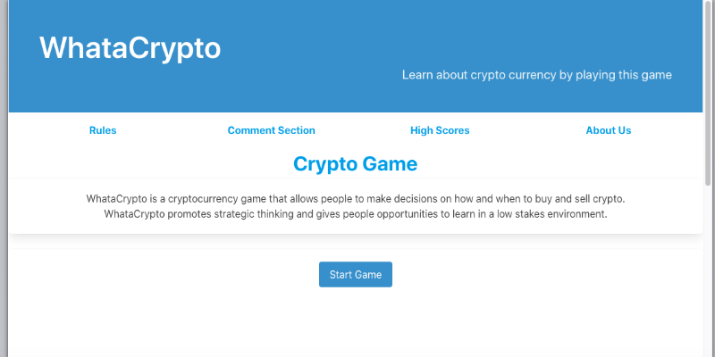
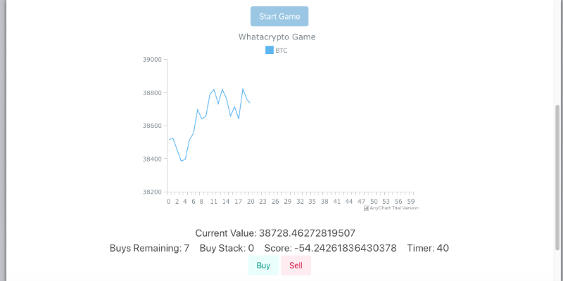

# whatacrypto-crypto-game

WhataCrypto is a cryptocurrency game that allows people to make decisions on how and when to buy and sell crypto. WhataCrypto promotes strategic thinking and gives people opportunities to learn in a low stakes environment.

## Table of Contents

- [Description](#description)
- [Screen Shots](#screenshots)
- [Installation](#installation)
- [References](#references)
- [TeamMembers](#team-members)
- [License](#license)

## Description
This repo contains a the whatacrypto game app and the corresponding code.

Github Repository: [WhataCrypto Github Repo](https://github.com/rbarbosa51/whatacrypto-crypto-game)

Github Pages: [WhataCrypto Page](https://rbarbosa51.github.io/whatacrypto-crypto-game/)

## Screenshots
WhataCrypto Home Page

Main Game

## Installation

It is meant to be viewed from Github Pages. To enjoy this experience visit:

[WhataCrypto Page](https://rbarbosa51.github.io/whatacrypto-crypto-game/)

## References

CoinApi.io: [coinapi.io](https://www.coinapi.io)

Google's Firebase [Firebase](https://firebase.google.com)

AnyChart.JS: [AnyChart](https://www.anychart.com)

JavaScript Array Sorting [MSDN](https://developer.mozilla.org/en-US/docs/Web/JavaScript/Reference/Global_Objects/Array/sort)

Share Link Generator: [ShareLinkGenarator](https://sharelinkgenerator.com)

## Team-members
Rafael Barbosa

Matthew Walker

Carlos Bautista

Jesus Perez Alvarado

Yen Nguyen

## License

MIT License

---- 
